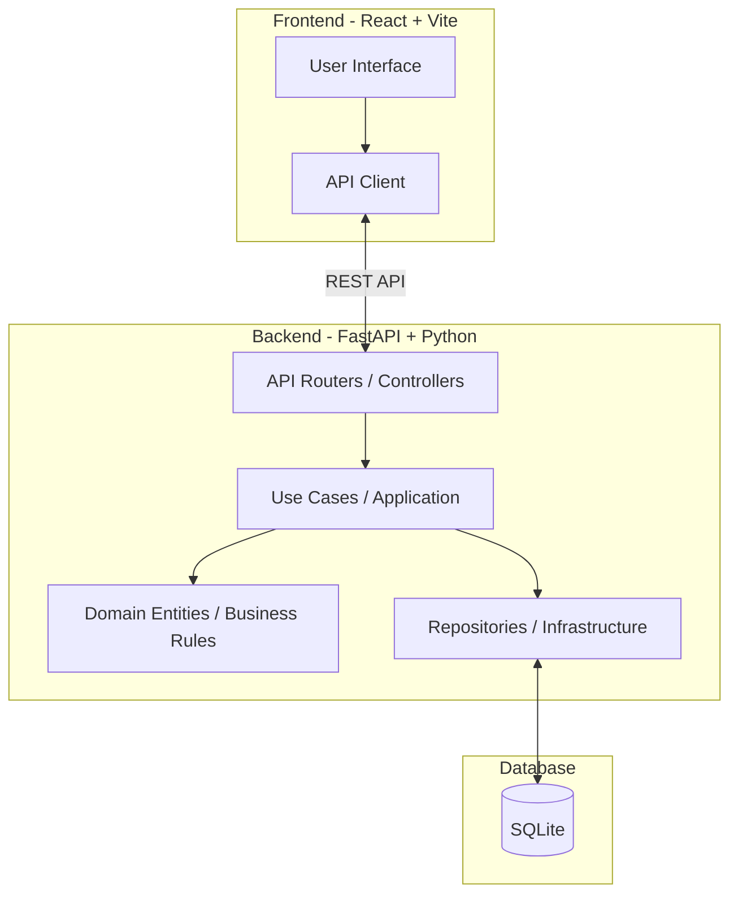

# Personal Finance Management (PFM) Application

Uma aplicação de gerenciamento financeiro pessoal de nível institucional, focada em governança financeira proativa e arquitetura robusta.

## 🚀 Funcionalidades Principais

- **Dashboard Integrado:** Visualização de saldo consolidado, despesas e receitas de forma intuitiva.
- **Orçamento Base-Zero (Zero-Based Budgeting):** Alocação inteligente e planejada de cada centavo.
- **Contabilidade de Partidas Dobradas (Double-Entry Bookkeeping):** Precisão absoluta em todas as transações, imitando o modelo contábil real (Débito e Crédito).
- **Gestão de Cartão de Crédito e Liquidez:** Reserva de liquidez em tempo real para o pagamento de faturas.
- **Integração Open Finance:** (Em desenvolvimento) Conexão com instituições bancárias garantindo idempotência e segurança.

## 🏗️ Arquitetura

O projeto adota os princípios da **Clean Architecture** e **Domain-Driven Design (DDD)**, isolando regras de negócio em Use Cases (Casos de Uso) bem definidos.



## 💻 Tecnologias Utilizadas

- **Frontend:** React, Vite (Migração para TypeScript em andamento)
- **Backend:** Python 3, FastAPI, Uvicorn, SQLAlchemy
- **Banco de Dados:** SQLite (com transição planejada para controle de versão de schema via Alembic)

## 🛠️ Como Rodar o Projeto (Ambiente de Desenvolvimento)

### Execução Automática (Apenas Windows)

Na raiz do projeto, basta executar o arquivo `run.bat` no terminal ou dando clique duplo:
```cmd
.\run.bat
```
Isso inciará tanto o Backend quanto o Frontend em janelas separadas do terminal.

### Execução Manual

**1. Iniciando o Backend (API)**
```bash
cd backend
python -m venv venv
# Ative o ambiente virtual (Windows)
.\venv\Scripts\activate
# Ative o ambiente virtual (Linux/Mac)
# source venv/bin/activate

pip install -r requirements.txt
python -m uvicorn main:app --reload --port 8000
```
- A API responde em: `http://localhost:8000`
- Documentação interativa (Swagger UI): `http://localhost:8000/docs`

**2. Iniciando o Frontend (Web)**
```bash
cd frontend
npm install
npm run dev
```
- A interface web responde em: `http://localhost:5173`

## 🗺️ Roadmap de Evolução (Prioridades Imediatas)

Atualmente, o projeto está em fase de estruturação e as seguintes prioridades técnicas estão sendo endereçadas:

- [ ] **Migração para TypeScript no Frontend:** Adicionar tipagem rigorosa para componentes financeiros.
- [ ] **Limpeza de Repositório (Git):** Configuração de um `.gitignore` maduro, com remoção isolada de banco de dados (`.db`) e caches (`__pycache__`).
- [ ] **Autenticação e Segurança:** Implementação de JWT real (substituindo acesso de "demo-user") e restrição de CORS (`allow_methods=["*"]`).
- [ ] **Testes Automatizados:** Cobertura de testes unitários (PyTest) com foco nos Casos de Uso (Use Cases) do motor de orçamentos.
- [ ] **Controle de Schema de Banco de Dados:** Substituição de `create_all_tables()` por migrações seguras utilizando **Alembic**.

---
*Este arquivo README.md é mantido como um documento vivo. Atualize-o sempre que a arquitetura ou o processo de deploy sofrer alterações significativas.*
